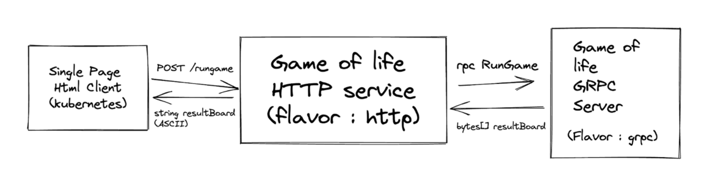

# Game of Life

## Prerequisites

Ensure the following tools are installed on your system:

- Docker and Docker Compose
- Git (if necessary)
- Go programming language
- Protocol Buffers Compiler [protoc](https://grpc.io/docs/languages/go/quickstart/#prerequisites)

## Design



## Setup

### Environment Setup

Export your DataDog API key to enable telemetry data reporting:

```sh
export DD_API_KEY=your_datadog_api_key_here
```

### Starting the application instrumented with OTel
The following docker compose file starts `game-of-life-otel` with the Datadog Agent set up with [OTLP Ingestion](https://docs.datadoghq.com/opentelemetry/otlp_ingest_in_the_agent/?tab=host).

```sh
docker compose -f docker-compose-otel.yaml up
```

### Starting the application instrumented with Datadog
The following docker compose file starts `game-of-life-dd` with the Datadog Agent set up with [OTLP Ingestion](https://docs.datadoghq.com/opentelemetry/otlp_ingest_in_the_agent/?tab=host).

```sh
docker compose -f docker-compose-dd.yaml up
```

### Starting both applications side by side
The following docker compose file starts both `game-of-life-otel` and `game-of-life-dd` with the Datadog Agent set up with [OTLP Ingestion](https://docs.datadoghq.com/opentelemetry/otlp_ingest_in_the_agent/?tab=host). This can be used to compare performance or runtime metrics between the two applications with different instrumentations.

```sh
docker compose -f docker-compose-dd-otel.yaml up
```

### Steps for Code Generation

gRPC requires generating code from .proto files. The following steps outline this process for Go.

```sh
protoc --go_out=../go/pb --go_opt=paths=source_relative \
       --go-grpc_out=../go/pb --go-grpc_opt=paths=source_relative \
       gameoflife.proto
```

### Understanding the Generated Files

- `gameoflife.pb.go`: Go bindings for your protocol buffers.
- `gameoflife_grpc.pb.go`: Go gRPC bindings for your service definitions.

For more details on the generation process, refer to the official gRPC Go [documentation](https://grpc.io/docs/languages/go/basics/#generating-client-and-server-code) for more information.
