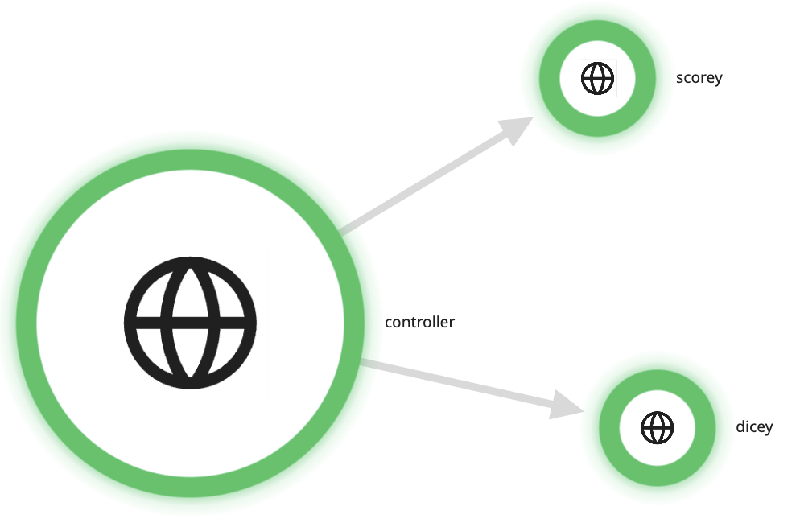

# Rolldice HTTP Metrics Helm Chart

This Helm chart deploys the rolldice application with HTTP metrics collection using OpenTelemetry on Kubernetes, specifically designed for EKS clusters.



## Prerequisites

- Kubernetes 1.20+
- Helm 3.8+
- EKS cluster with appropriate IAM permissions
- Docker images built and available in a container registry

## Installation

### 1. Build and Push Docker Images

First, build and push your Docker images to a container registry (ECR, Docker Hub, etc.):

```bash
# Build images
docker build -t your-registry/game-controller:latest ./game_controller
docker build -t your-registry/rolling:latest ./rolling
docker build -t your-registry/scoring:latest ./scoring

# Push images
docker push your-registry/game-controller:latest
docker push your-registry/rolling:latest
docker push your-registry/scoring:latest
```

### 2. Create Datadog API Key Secret

Before installing the chart, create a Kubernetes secret containing your Datadog API key:

```bash
kubectl create secret generic datadog-secret \
  --from-literal=api-key=your-datadog-api-key
```

### 3. Install the Chart

#### Basic Installation (Debug Mode)
```bash
helm install rolldice ./helm-chart
```

#### With Datadog Integration
```bash
helm install rolldice ./helm-chart \
  --set otelCollector.datadog.apiKeySecret.name="datadog-secret" \
  --set image.registry="your-registry/" \
  --set gameController.image.repository="game-controller" \
  --set rolling.image.repository="rolling" \
  --set scoring.image.repository="scoring"
```

#### With Exponential Histograms
```bash
helm install rolldice ./helm-chart \
  --set global.useExponentialHistograms=true \
  --set otelCollector.datadog.apiKeySecret.name="datadog-secret"
```

## Configuration

### Key Values

| Parameter | Description | Default |
|-----------|-------------|---------|
| `global.useExponentialHistograms` | Enable exponential histograms for HTTP metrics | `false` |
| `otelCollector.datadog.apiKeySecret.name` | Name of the secret containing Datadog API key | `""` |
| `otelCollector.datadog.apiKeySecret.key` | Key in the secret containing the API key | `"api-key"` |
| `otelCollector.datadog.site` | Datadog site (e.g., datadoghq.com) | `"datadoghq.com"` |
| `image.registry` | Container registry prefix | `""` |
| `gameController.replicaCount` | Number of game controller replicas | `1` |
| `rolling.replicaCount` | Number of rolling service replicas | `1` |
| `scoring.replicaCount` | Number of scoring service replicas | `1` |

### Resource Configuration

Each service has configurable resource limits and requests:

```yaml
gameController:
  resources:
    limits:
      cpu: 500m
      memory: 512Mi
    requests:
      cpu: 250m
      memory: 256Mi
```

### Environment-Specific Values

Create environment-specific values files:

**values-prod.yaml**:
```yaml
global:
  useExponentialHistograms: true
  resourceAttributes:
    deploymentEnvironment: "production"

gameController:
  replicaCount: 3
  resources:
    limits:
      cpu: 1000m
      memory: 1Gi

otelCollector:
  datadog:
    apiKeySecret:
      name: "datadog-secret"
      key: "api-key"
```

## EKS-Specific Configuration

### IAM Roles for Service Accounts (IRSA)

If using AWS services, configure IRSA:

```yaml
serviceAccount:
  create: true
  annotations:
    eks.amazonaws.com/role-arn: arn:aws:iam::ACCOUNT:role/rolldice-service-role
```

### Node Groups and Scheduling

Configure node affinity for different workloads:

```yaml
gameController:
  affinity:
    nodeAffinity:
      requiredDuringSchedulingIgnoredDuringExecution:
        nodeSelectorTerms:
        - matchExpressions:
          - key: node.kubernetes.io/instance-type
            operator: In
            values: ["m5.large", "m5.xlarge"]
```

## Monitoring and Observability

### Health Checks

The chart includes health checks for all services:
- **Game Controller**: `/actuator/health`
- **Rolling Service**: `/rolldice?player=healthcheck`
- **Scoring Service**: `/update_score` (with proper headers)

### Metrics Collection

When `global.useExponentialHistograms=true`:
- HTTP server/client duration metrics use exponential histograms
- Better accuracy for latency measurements
- Reduced storage overhead

### Traces and Logs

All services automatically instrument:
- HTTP requests/responses
- Database operations (if applicable)
- Custom spans for business logic

## Usage Examples

### Test the Application

```bash
# Port forward to access the game controller
kubectl port-forward svc/game-controller 5002:5002

# Play a game
curl -X POST http://localhost:5002/play_game \
  -H "Content-Type: application/json" \
  -d '{"player": "testuser"}'
```

### Scale Services

```bash
# Scale the game controller
kubectl scale deployment game-controller --replicas=5

# Or use Helm upgrade
helm upgrade rolldice ./helm-chart --set gameController.replicaCount=5
```

### Enable Debug Mode

To run without Datadog integration (debug mode with console output only):

```bash
helm upgrade rolldice ./helm-chart --set otelCollector.datadog.apiKeySecret.name=""
```

## Troubleshooting

### Check Pod Status
```bash
kubectl get pods -l app.kubernetes.io/instance=rolldice
```

### View Logs
```bash
# Game controller logs
kubectl logs -l app.kubernetes.io/name=game-controller

# OpenTelemetry collector logs  
kubectl logs -l app.kubernetes.io/name=otelcol
```

### Check OpenTelemetry Configuration
```bash
kubectl get configmap rolldice-otel-config -o yaml
```

### Verify Service Discovery
```bash
# Check services
kubectl get svc -l app.kubernetes.io/instance=rolldice

# Test connectivity
kubectl run test-pod --image=curlimages/curl:latest --rm -it -- /bin/sh
# Inside the pod:
curl http://rolling:5004/rolldice?player=test
```

## Cleanup

```bash
helm uninstall rolldice
```

## Advanced Configuration

### Custom OpenTelemetry Configuration

You can override the OpenTelemetry collector configuration by providing your own ConfigMap:

```yaml
otelCollector:
  customConfig: |
    receivers:
      otlp:
        protocols:
          grpc:
            endpoint: 0.0.0.0:4317
    # ... your custom config
```

### Ingress Configuration

Enable ingress to expose services externally:

```yaml
ingress:
  enabled: true
  className: "nginx"
  hosts:
    - host: rolldice.example.com
      paths:
        - path: /
          pathType: Prefix
```

This Helm chart provides a production-ready deployment of the rolldice application with comprehensive observability features suitable for EKS environments.