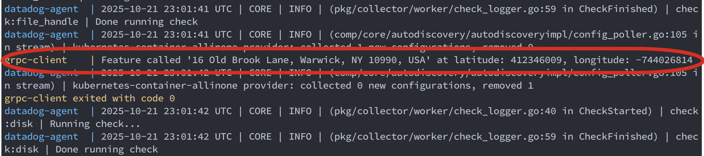

# gRPC Route Guide with Datadog Integration

A complete dockerized gRPC application implementing a route-mapping application written in Python, with full Datadog APM (Application Performance Monitoring) integration. This project demonstrates a simple unary RPC call with automatic distributed tracing.

This application has a client that connects to a remote server using gRPC to get the name or postal address of what's located at specific coordinates on a map.

At `route_guide_client.py` it is given certain coordinates:
```python
point = route_guide_pb2.Point(latitude=412346009, longitude=-744026814)
```
This will check `route_guide_db.json` file and spit the address:
```
Feature called '16 Old Brook Lane, Warwick, NY 10990, USA' at latitude: 412346009, longitude: -744026814
```


## 🏗️ Architecture

The application consists of three Docker containers:

1. **gRPC Server** (`grpc-server`) - Implements the RouteGuide service on port 50051
2. **gRPC Client** (`grpc-client`) - Makes RPC calls to the server
3. **Datadog Agent** (`datadog`) - Collects traces and metrics from both services

All containers communicate through a Docker bridge network (`grpc-network`).

## 📋 Features

- **gRPC Service Implementation:**
  - `GetFeature` - Unary RPC that retrieves feature information at a given location
  - Server binds to `0.0.0.0:50051` to accept connections from other containers
  - Client connects to `grpc-server:50051` using Docker's internal DNS

- **Datadog Integration:**
  - Automatic distributed tracing with `ddtrace` library
  - `patch_all()` instrumentation for zero-code-change monitoring
  - APM traces showing client → server communication
  - Service performance metrics and analytics

- **Docker Compose Orchestration:**
  - Multi-container setup with dependency management
  - Automatic service discovery via container names
  - Environment-based configuration

## 📦 Prerequisites

- Docker (version 20.10 or higher)
- Docker Compose v2 (integrated with Docker Desktop)
- Datadog account and API key (get one at [datadoghq.com](https://www.datadoghq.com))

## 📁 Project Structure

```
apps/rpc/python/
├── protos/
│   └── route_guide.proto          # Protocol Buffer definition
├── route_guide_server.py          # gRPC server implementation
├── route_guide_client.py          # gRPC client implementation
├── route_guide_resources.py       # Helper to load route database
├── route_guide_db.json            # Sample location database
├── Dockerfile                     # Container image definition
├── docker-compose.yml             # Multi-container orchestration
├── requirements.txt               # Python dependencies
├── datadog-config.yaml            # Datadog agent configuration
├── .env                          # Environment variables (your API key)
├── .env.example                  # Template for environment variables
├── .gitignore                    # Git ignore rules
└── README.md                     # This file
```

## 🚀 Quick Start

### 1. Navigate to the Project Directory

```bash
cd /path/to/grpc_python
```

### 2. Configure Datadog

If you don't have a `.env` file yet, create one from the example:

```bash
cp .env.example .env
```

Edit `.env` and add your Datadog API key:

```bash
DD_API_KEY=your_actual_datadog_api_key_here
DD_SITE=datadoghq.com  # Change if you use a different Datadog site
```

**To get your API key:**
1. Log in to [Datadog](https://app.datadoghq.com)
2. Go to **Organization Settings** → **API Keys**
3. Create a new API key or copy an existing one

### 3. Build and Run

**Note:** Use `docker compose` (with a space) instead of `docker-compose` for Docker Compose v2.

Build the Docker images:
```bash
docker compose build
```

Start all services:
```bash
docker compose up
```

Or run in detached mode:
```bash
docker compose up -d
```

Or build and run in one command:
```bash
docker compose up --build
```

Stop current containers:
```bash
docker compose down
```


## 📊 Monitoring with Datadog

After starting the services, you can view your application's performance in Datadog:

### Viewing Traces

1. Wait 1-2 minutes for traces to appear
2. Go to [Datadog APM → Traces](https://app.datadoghq.com/apm/traces)
3. Look for services: `route-guide-server` and `route-guide-client`
4. Click on any trace to see:
   - Request duration
   - gRPC method called (`GetFeature`)
   - Service dependencies
   - Spans across client and server

### Service Map

1. Go to **APM → Service Map**
2. See visual representation of:
   - `route-guide-client` → `route-guide-server` communication
   - Request rates and latencies
   - Error rates

### Key Services in Datadog

- **route-guide-server** - The gRPC server service
- **route-guide-client** - The gRPC client service

## 🔧 How It Works

### Datadog Tracing Implementation

Both the server and client use the `ddtrace` library with automatic instrumentation:

```python
from ddtrace import patch_all

# Enable Datadog tracing for gRPC
patch_all()
```

The `patch_all()` function automatically instruments:
- gRPC client calls
- gRPC server handlers
- Thread pool executors
- Other supported libraries

### Environment Variables

The containers are configured with these Datadog environment variables:

```yaml
DD_AGENT_HOST=datadog              # Datadog agent hostname
DD_TRACE_AGENT_PORT=8126           # APM trace port
DD_SERVICE=route-guide-server      # Service name in Datadog
DD_ENV=production                   # Environment tag
DD_VERSION=1.0.0                   # Version tag
DD_TRACE_ENABLED=true              # Enable tracing
```

### Network Configuration

- Server listens on `0.0.0.0:50051` (accepts connections from any interface)
- Client connects to `grpc-server:50051` (uses Docker's internal DNS)
- All containers are on the same Docker bridge network

## 🔧 Development

### Modifying the Proto File

If you modify `protos/route_guide.proto`:

1. Rebuild the Docker images (proto compilation happens during build):
```bash
docker compose build
```

2. Restart the services:
```bash
docker compose down
docker compose up
```

### Testing Individual Components

Run just the server with Datadog:
```bash
docker compose up grpc-server datadog
```

In another terminal, run the client:
```bash
docker compose up grpc-client
```

### Adding More gRPC Methods

1. Update `protos/route_guide.proto` with new RPC methods
2. Implement the methods in `route_guide_server.py`
3. Call the methods from `route_guide_client.py`
4. Rebuild and restart containers


## 🛑 Stopping the Application

Stop all containers:
```bash
docker compose down
```

Stop and remove all data:
```bash
docker compose down -v
```

Force remove all containers:
```bash
docker compose down --remove-orphans
```

## 🔐 Security Notes

- ⚠️ Never commit your `.env` file with real API keys to version control
- The `.env.example` file is provided as a safe template
- Use secrets management (e.g., AWS Secrets Manager, HashiCorp Vault) in production
- The `.gitignore` file excludes `.env` by default

## 📖 Additional Resources

- [gRPC Documentation](https://grpc.io/docs/)
- [gRPC Python Quick Start](https://grpc.io/docs/languages/python/quickstart/)
- [Datadog APM Documentation](https://docs.datadoghq.com/tracing/)
- [Datadog Python Tracing](https://docs.datadoghq.com/tracing/setup_overview/setup/python/)
- [Protocol Buffers Guide](https://developers.google.com/protocol-buffers)
- [Docker Compose Documentation](https://docs.docker.com/compose/)

## 🤝 Contributing

Feel free to submit issues and enhancement requests!

## 📄 License

This project is provided as-is for educational and demonstration purposes.

---

**Made with ❤️ for learning gRPC and Datadog APM**
