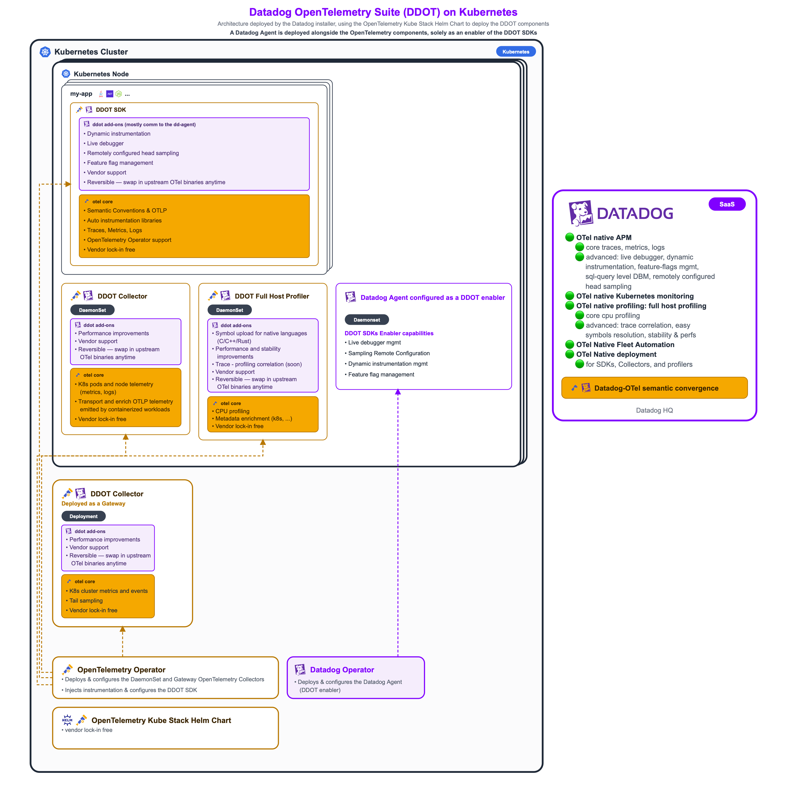

# Installation guide

The `install` script, the recommended way to install, sets up OpenTelemetry-based Kubernetes and application
monitoring for Datadog in one go. It installs:

- the [OpenTelemetry Kube Stack][chart]: the OpenTelemetry Operator, the `cluster` and `daemon` collectors, and the
  optional host profiler, which collect the Kubernetes and application telemetry. The OpenTelemetry Operator also
  deploys an `Instrumentation` custom resource, an instrumentation configuration that instruments annotated
  Kubernetes workloads with the DDOT SDKs, Datadog's version of the OpenTelemetry APM SDKs;
- [cert-manager][cm], if not already installed, for the OpenTelemetry Operator's admission webhook;
- the [Datadog Operator][dd-operator] and a Datadog Agent, installed only so that the Datadog Agent acts as an enabler
  of the DDOT SDKs: the Agent enables the Datadog-specific features of the DDOT SDKs, such as Live Debugger, Dynamic
  Instrumentation, Remote Configuration of head sampling, or Feature Flag Management, on top of the standard
  OpenTelemetry capabilities. The Datadog Agent neither collects the Kubernetes telemetry nor instruments the
  applications: the OpenTelemetry collectors and the OpenTelemetry Operator do.



See [What this deploys](README.md#what-this-deploys) for the architecture, and
[Install without the `install` script](#install-without-the-install-script) to perform the same installation manually
(not recommended).

## Before you begin

On the machine running the script:

- **Bash** 3.2 or later, on Linux or macOS (the stock `/bin/bash` 3.2 on macOS works).
- **`kubectl`**, with its current context pointing at the target cluster (`kubectl config current-context`), and
  permissions to create namespaces, CRDs, cluster roles, and webhooks (typically `cluster-admin`).
- **`helm`**, v3 or v4.
- **`curl`**, to download the script and its configuration files.

From Datadog:

- A Datadog [API key][dd-api-keys] and your [Datadog site][dd-site] (`datadoghq.com`, `datadoghq.eu`,
  `us3.datadoghq.com`...).
- A Datadog [application key][dd-app-keys], optional but strongly recommended: it lets you manage the Datadog Agent
  from [Fleet Automation](README.md#fleet-automation-optional).

On the cluster:

- Linux nodes with kernel >= 5.10 and Kubernetes >= 1.30, only if you enable the optional eBPF host profiler.
- On platforms other than EKS, GKE, and AKS, or with an application key, a cluster name that follows the
  [cluster name constraints](README.md#cluster-name-constraints) (lowercase letters, digits, `-` and `.`).

## 1. Download the script

You don't need to clone the repository: by default, the script downloads its configuration files (`values.yaml`,
`datadog-agent.yaml`...) from GitHub.

```sh
curl -fsSL -o install https://raw.githubusercontent.com/DataDog/opentelemetry-examples/fd6eca3b5a393e8416a1beb1450d97e1d9df89a6/guides/kubernetes/configuration/opentelemetry-kube-stack/install
chmod +x install
```

## 2. Provide the Datadog credentials

The script reads the Datadog credentials from a `.env` file next to it (in the current directory when run with
`bash <(curl ...)`). Without a `.env` file, it prompts for them on every run.

To skip the credential prompts, create the `.env` file beforehand:

```sh
cat > .env <<'EOF'
export DD_SITE="datadoghq.com"
export DD_API_KEY="<your-datadog-api-key>"
# Optional but strongly recommended, enables Fleet Automation:
# export DD_APP_KEY="<your-datadog-application-key>"
EOF
chmod 600 .env
```

`DD_API_KEY` is required. `DD_SITE` defaults to `datadoghq.com` when missing from `.env`. Keep `.env` out of version
control (this folder's `.gitignore` ignores it).

## 3. Run the script

```sh
./install
```

The script asks the following questions:

| Prompt                         | Answer                                                                                                                     |
|:-------------------------------|:---------------------------------------------------------------------------------------------------------------------------|
| Datadog Site                   | Your Datadog site, e.g. `datadoghq.eu`. Required. Only asked without a `.env` file.                                        |
| Datadog API Key                | Your API key (input hidden). Required. Only asked without a `.env` file.                                                   |
| Datadog Application Key        | Optional but strongly recommended (input hidden): enables Fleet Automation. Only asked without a `.env` file.              |
| Kubernetes cluster type        | `EKS`, `GKE`, or `AKS` to auto-detect the cluster name from the cloud provider, `Other` otherwise.                         |
| Kubernetes Cluster Name        | Asked for `Other`, defaults to `unknown-k8s-cluster`. Also asked on `EKS`, `GKE`, and `AKS` with an application key, for Fleet Automation, defaulting to the name in the `kubectl` context. Uppercase letters are lowercased and `_` replaced with `-`. |
| Deployment Environment Name    | Sets `deployment.environment.name` on all telemetry. Defaults to `production`.                                             |
| Enable the eBPF host profiler? | `y` to deploy the host profiler on every node. Defaults to `N`: its pods need eBPF privileges.                             |
| Egress NetworkPolicy?          | Only asked with the host profiler: `s`tandard or `c`ilium on clusters enforcing NetworkPolicy, `n`one otherwise (default). |

It then:

- creates the `opentelemetry-operator-system` and `datadog` namespaces;
- creates the `datadog-secret` secret in both namespaces;
- installs cert-manager, unless it's already installed (detected by its `certificates.cert-manager.io` CRD);
- installs or upgrades the OpenTelemetry Kube Stack Helm chart, optionally enabling the `host-profiler` collector in the
  same release;
- installs or upgrades the Datadog Operator (`datadog/datadog-operator` chart) in the `datadog` namespace,
  with [Fleet Automation](README.md#fleet-automation-optional) enabled when an application key is provided;
- applies the `datadog-agent.yaml` `DatadogAgent` custom resource to the `datadog` namespace, substituting the cluster
  name and site into it.

Some `WARNING` lines are expected and harmless, for example when a namespace already exists.

## 4. Verify the installation

Check that the collectors, the OpenTelemetry Operator, and the Datadog Operator and Agent are running:

```sh
kubectl get pods --namespace opentelemetry-operator-system
kubectl get pods --namespace datadog
kubectl get opentelemetrycollectors --namespace opentelemetry-operator-system
kubectl get datadogagent --namespace datadog
```

Expect a `cluster` OpenTelemetry Collector pod, one `daemon` OpenTelemetry Collector pod per node (plus one 
`host-profiler` pod per node when enabled), and one Datadog Agent pod per node next to the Datadog Operator and Cluster
Agent.

After a few minutes, the cluster shows up in Datadog's Kubernetes views, under the cluster name you entered (or the one
detected on EKS, GKE, and AKS).

## 5. Instrument your applications

The OpenTelemetry Operator deploys an `Instrumentation` Kubernetes custom resource,
`opentelemetry-operator-system/opentelemetry-kube-stack`: an instrumentation configuration that instruments annotated
pods with the DDOT SDKs, Datadog's version of the OpenTelemetry APM SDKs, and points them at the `daemon`
collector. The Datadog Agent enables the DDOT SDKs' Datadog-specific features, such as Live Debugger, Dynamic
Instrumentation, Remote Configuration of head sampling, or Feature Flag Management. Add the annotation for your application's language to its pod template, along
with the `admission.datadoghq.com/enabled` label, for example for Java:

```yaml
spec:
  template:
    metadata:
      annotations:
        instrumentation.opentelemetry.io/inject-java: opentelemetry-operator-system/opentelemetry-kube-stack
        resource.opentelemetry.io/service-name: my-service
      labels:
        # Prevent dual instrumentation by the Datadog Operator and the OpenTelemetry Operator.
        admission.datadoghq.com/enabled: "false" # Label values are strings: keep the quotes.
```

The other languages use `inject-nodejs`, `inject-python`, and `inject-dotnet`.

The `admission.datadoghq.com/enabled: "false"` label makes Datadog's admission controller skip the pod,
so that the pod is never instrumented by both the Datadog Operator and the OpenTelemetry Operator. The Datadog
Operator's APM instrumentation is disabled by default (`features.apm.instrumentation.enabled: false` in
`datadog-agent.yaml`): the label protects your pods if this configuration is later changed, for example to
auto-instrument other workloads with Datadog's single-step APM instrumentation. See
[Hybrid OTel + Datadog APM instrumentation](README.md#hybrid-otel--datadog-apm-instrumentation).

## Options

Run `./install --help` for the full list.

| Option                  | Use                                                                                                                                     |
|:------------------------|:----------------------------------------------------------------------------------------------------------------------------------------|
| `--local`               | Use the configuration files next to the script instead of downloading them, e.g. to test changes from a clone of this repository.       |
| `--config-url=<url>`    | Download the configuration files from another GitHub folder (`https://github.com/<owner>/<repo>/tree/<branch>/<path>`) or raw base URL. |
| `<overlay-values.yaml>` | A values file merged on top of the `values.yaml` file of the OpenTelemetry Kube stack Helm chart: a local file, a URL, or a path relative to the configuration folder.                      |

For advanced users only, for example to customize the configuration with your own values file:

```sh
./install path/to/my/overlay-values.yaml
```

## Troubleshooting

- **`Could not download ...`**: the configuration files couldn't be fetched from GitHub. Check the network access and
  the `--config-url`, or run from a clone of this repository with `--local`.
- **`No cluster name set: the Datadog Operator's Remote Configuration requires one`**: Fleet Automation needs an
  explicit cluster name, and none was entered (the cluster name couldn't be derived from the `kubectl` context). Re-run
  and enter the cluster name.
- **`Using cluster name '...' instead of '...'`**: the cluster name you entered was normalized to satisfy the Datadog
  Agent's constraints. Use the normalized name when looking for the cluster in Datadog.

## Uninstalling

The companion `uninstall` script removes everything the `install` script deployed. It's meant for development
clusters: it also uninstalls cert-manager and deletes the cert-manager, OpenTelemetry, and Datadog Operator CRDs,
which deletes all their custom resources cluster-wide, including ones the `install` script didn't create. It lists
what it deletes and asks for confirmation:

```sh
curl -fsSL -o uninstall https://raw.githubusercontent.com/DataDog/opentelemetry-examples/fd6eca3b5a393e8416a1beb1450d97e1d9df89a6/guides/kubernetes/configuration/opentelemetry-kube-stack/uninstall
chmod +x uninstall
./uninstall
```

## Install without the `install` script

> [!IMPORTANT]
> The [`install` script](#1-download-the-script) is the strongly recommended way to install. Follow these manual steps
> only if you can't or don't want to use it, for example to integrate the installation into your own tooling, such as
> GitOps pipelines.

To perform the same installation without the `install` script, create a Kubernetes secret for the Datadog credentials,
install cert-manager, then apply a platform-specific values overlay. Run these commands from a clone of this repository,
in this folder: they use its `values.yaml`, `examples/`, and `datadog-agent.yaml` files.

Set the Datadog credentials:

```sh
export DD_API_KEY="<your-datadog-api-key>"
export DD_SITE="datadoghq.com" # Use your Datadog site when different.
```

Create the namespaces and the `datadog-secret` secret, duplicated into both — `opentelemetry-operator-system` for the
OTel collectors' Datadog exporter, `datadog` for the `DatadogAgent` custom resource. Two copies are needed because a
`DatadogAgent` custom resource can only reference a secret in its own namespace:

```sh
kubectl create namespace opentelemetry-operator-system \
  --dry-run=client -o yaml | kubectl apply -f -
kubectl create namespace datadog \
  --dry-run=client -o yaml | kubectl apply -f -

for NS in opentelemetry-operator-system datadog; do
  kubectl create secret generic datadog-secret \
    --namespace "$NS" \
    --from-literal="api-key=$DD_API_KEY" \
    --from-literal="dd-site=$DD_SITE" \
    --dry-run=client -o yaml | kubectl apply -f -
done
```

Install cert-manager:

```sh
helm repo add jetstack https://charts.jetstack.io
helm repo update
helm upgrade --install cert-manager jetstack/cert-manager \
  --namespace cert-manager \
  --create-namespace \
  --set crds.enabled=true \
  --wait \
  --timeout 5m
```

Create `deployment/values.yaml` by copying the example for the cluster platform, then set its deployment environment.
EKS, GKE, and AKS enable the appropriate resource detector and automatically determine `k8s.cluster.name`:

```sh
mkdir -p deployment

# Choose one:
cp examples/eks-deployment/values.yaml deployment/values.yaml
cp examples/gcp-deployment/values.yaml deployment/values.yaml
cp examples/aks-deployment/values.yaml deployment/values.yaml
```

For other Kubernetes platforms, start with the manual cluster-name example and replace `my-k8s-cluster` and `production`
with the cluster name and deployment environment. `DD_SITE` continues to be sourced from `datadog-secret`.

```sh
mkdir -p deployment
cp examples/manually-set-k8s-cluster-name/values.yaml deployment/values.yaml
```

The selected file is an overlay for this directory's base `values.yaml`; add any deployment-specific configuration to
`./deployment/values.yaml`. Install or upgrade the chart with both files:

```sh
helm repo add open-telemetry https://open-telemetry.github.io/opentelemetry-helm-charts
helm repo update
helm upgrade --install opentelemetry-kube-stack \
  open-telemetry/opentelemetry-kube-stack \
  --version 0.24.2 \
  --namespace opentelemetry-operator-system \
  --values ./values.yaml \
  --values ./deployment/values.yaml
```

Alternatively, if you want to enable the `host-profiler` collector:

```sh
helm upgrade --install opentelemetry-kube-stack \
  open-telemetry/opentelemetry-kube-stack \
  --version 0.24.2 \
  --namespace opentelemetry-operator-system \
  --set collectors.host-profiler.enabled=true \
  --values ./values.yaml \
  --values ./host-profiler-rbac-values.yaml \
  --values ./deployment/values.yaml
```

On clusters enforcing NetworkPolicy, also apply one of:

```sh
kubectl apply -f ./host-profiler-network-policy.yaml          # any enforcing CNI
# or
kubectl apply -f ./host-profiler-cilium-network-policy.yaml   # Cilium, FQDN-scoped egress
```

Finally, install the [Datadog Operator][dd-operator] and apply the `DatadogAgent` custom resource, substituting the
cluster name and site placeholders (`<CLUSTER_NAME>` / `<DD_SITE>`) in `datadog-agent.yaml`. Use the same cluster name
as `deployment/values.yaml` above, following the [cluster name constraints](README.md#cluster-name-constraints) (leave
`K8S_CLUSTER_NAME` empty on EKS/GKE/AKS, where it's auto-detected instead):

```sh
export K8S_CLUSTER_NAME="my-k8s-cluster" # empty string on EKS/GKE/AKS

helm repo add datadog https://helm.datadoghq.com
helm repo update
helm upgrade --install datadog-operator \
  datadog/datadog-operator \
  --namespace datadog \
  --wait --timeout 5m

# On EKS/GKE/AKS (empty K8S_CLUSTER_NAME), drop the clusterName line so the Agent auto-detects it.
# Likewise, only set the Agent hostname from the Kubernetes node name and the cluster name on non-cloud clusters.
if [[ -n "$K8S_CLUSTER_NAME" ]]; then
  CLUSTER_NAME_SED_ARGS=(-e "s|<CLUSTER_NAME>|$K8S_CLUSTER_NAME|" -e "/<HOSTNAME_FROM_NODE_NAME:/d")
else
  CLUSTER_NAME_SED_ARGS=(-e "/<CLUSTER_NAME>/d" -e "/<HOSTNAME_FROM_NODE_NAME:BEGIN>/,/<HOSTNAME_FROM_NODE_NAME:END>/d")
fi

sed \
  "${CLUSTER_NAME_SED_ARGS[@]}" \
  -e "s|<DD_SITE>|$DD_SITE|" \
  ./datadog-agent.yaml \
  | kubectl apply --namespace datadog -f -
```

[chart]: https://github.com/open-telemetry/opentelemetry-helm-charts/tree/main/charts/opentelemetry-kube-stack
[cm]: https://cert-manager.io/docs/installation/
[dd-operator]: https://github.com/DataDog/datadog-operator
[dd-api-keys]: https://docs.datadoghq.com/account_management/api-app-keys/#api-keys
[dd-app-keys]: https://docs.datadoghq.com/account_management/api-app-keys/#application-keys
[dd-site]: https://docs.datadoghq.com/getting_started/site/
